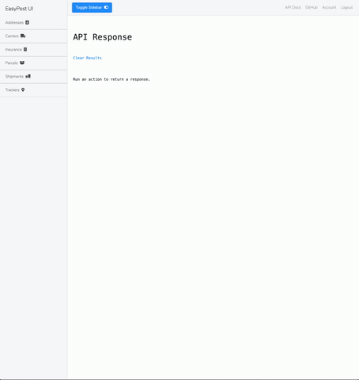

<div align="center">

# EasyPost UI

Easily interact with the EasyPost API to order one-off packages and labels via a simple UI.

[](https://travis-ci.com/Justintime50/easypost-ui)
[](https://coveralls.io/github/Justintime50/easypost-ui?branch=master)
[](LICENSE)



</div>

## What Can it Do?

- Create shipments and printable labels with upwards of 100 carriers
- Retrieve addresses, carriers, insurance, parcels, shipments, and trackers from EasyPost
- Track a package
- Insure a package
- Refund a shipment
- Support multiple users with unique logins and EasyPost API keys

## How it Works

The EasyPost API creates a label once it receives a `from_address`, `to_address`, `parcel`, and the user selects their preferred shipping rate/method. Print the label, slap it on your package, and drop it off at your carrier's location. That's it!

## Install

**EasyPost API:** You'll need a test or production API key from [EasyPost's website](https://easypost.com). Create an account and grab the API key you'd like to use. If using your production API key, make sure to setup billing info on your EasyPost account.

1) This project requires [Docker](https://www.docker.com/products/docker-desktop) and an account. Install and login to Docker.
2) Run `./setup.sh` in the project's root directory which will setup the entire project for you.
3) Navigate to `localhost:8000` in a browser. Register an account and add your API Key on the `/account` page. You're all set!

## Usage

Once the project is setup, simply interact with the various links in the app to interact with the API. Create records, retrieve them, and purchase shipping labels all without needing to do the hard work of mapping an API. 

- **Production:** Run `docker-compose up -d` in the project's root directory for any production deployments.
- **Development:** Run `docker-compose up -f docker-compose-dev.yml -d` in the project's root directory for development deployments. <i>NOTE: You'll need to install project dependencies either manually inside the Docker container once it's up or outside of the Docker container and on your machine.</i>

## Development

```bash
# Install dev dependencies
cd src && php composer.phar install -q --no-ansi --no-interaction --no-scripts --no-suggest --no-progress --prefer-dist

# Run tests
./src/vendor/bin/phpunit
```

### PHP Standards Fixer

PHP coding standards can be fixed automatically: 

```bash
./src/vendor/bin/php-cs-fixer fix . --verbose --show-progress=estimating
```

## Disclaimer

This project is not endorsed or maintained by EasyPost.
